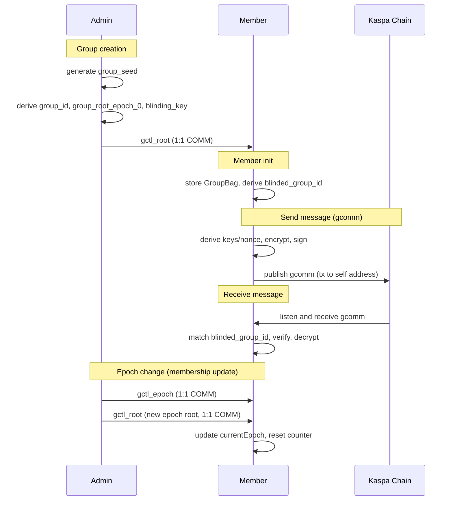

# Kasia Group Messaging Initial Protocol (Kasia Client only)

## Overview

**Purpose**: Provide group message secrecy on Kaspa (via Kasia) with O(1) on-chain message size, where everyone in the group can read everyone else's messages.

**Core design**:
- Single admin controls group lifecycle and key distribution (trusted)
- Epoch-based forward secrecy via mandatory key rotation on membership changes
- No quantum security added to existing Kasia spec

## Cryptography

- **AEAD**: ChaCha20-Poly1305
- **KDF**: HKDF-SHA256
- **Hash**: SHA256
- **Signatures**: Schnorr secp256k1
- **RNG**: Cryptographically secure

## Data Structures

**GroupBag (Storage Schema)**:
```typescript
type GroupBag = {
  groupSeed: string | null;        // admin only, 32 bytes hex
  groupRootEpoch: string;          // all members, 32 bytes hex
  blindingKey: string;             // all members, 32 bytes hex
  currentEpoch: number;
  members: GroupMember[];
  deviceId: string;                // 16 bytes hex, persistent per device
  msgCounter: number;              // monotonic per (group_id, epoch, device_id)
};
```

**Kasia Group Message Format**:
```
ciph_msg:1:gcomm:{blinded_group_id}:{epoch}:{sender_id}:{sender_pub}:{msg_id}:{ciphertext}:{signature}
```
Notes:
- `sender_pub` is 32-byte x-only secp256k1 pubkey hex.
- `blinded_group_id` is per-sender (derived from blinding key + sender pubkey).

## Key Derivation

```
group_seed (admin only)
├── group_id = SHA256("ciph_msg:groupid" || group_seed)
├── group_root_epoch_N = HKDF(group_seed, salt=group_id || epoch_le, info="kasia:groot")
│   ├── sender_key = HKDF(group_root, salt=group_id || epoch_le, info="kasia:gcomm:key" || sender_id)
│   └── sender_nonce_key = HKDF(group_root, salt=group_id || epoch_le, info="kasia:gcomm:nonce" || sender_id)
│       └── nonce = HKDF(sender_nonce_key, salt=msg_id, info="kasia:gcomm:nonce")[0:12]
└── blinding_key = HKDF(group_seed, salt=group_id, info="kasia:blinding_key")
    └── blinded_group_id_user = HKDF(blinding_key, salt=user_pub (x-only), info="kasia:blinded_gid")
```

## Protocol Flow

**Group creation (admin)**:
1. Generate `group_seed`.
2. Derive `group_id`, `group_root_epoch_0`, `blinding_key`.
3. Generate `device_id` (16 random bytes).
4. Distribute `gctl_root` (includes group_root_epoch, blinding_key, members, name) via 1:1 COMM (admin does not send to self).

**Member init**:
1. Generate `device_id` (16 random bytes).
2. Store `GroupBag` with `currentEpoch = payload.epoch`.
3. Derive `blinded_group_id` from `blinding_key` and user pubkey.

**Send**:
1. Increment and persist `msgCounter`, then use that value for (group_id, epoch, device_id).
2. `msg_id = device_id (16 bytes) || msgCounter_le (u64)` -> 24 bytes.
3. `sender_id = SHA256(sender_address_string_bytes)`.
4. Derive `sender_key` and `sender_nonce_key`, then `nonce`.
5. `AAD = version(1 byte) || "gcomm" || group_id || epoch_le(u64) || sender_id || msg_id`.
6. Encrypt, sign `AAD || ciphertext`, create `gcomm` message.
7. Send on-chain to self address

**Receive**:
1. Match `blinded_group_id` by recomputing from candidate groups and sender pubkey.
2. Verify sender pubkey maps to sender address.
3. Re-derive keys/nonce, verify signature, decrypt.

**Epoch change (membership update)**:
1. Admin increments epoch, sends `gctl_epoch` (notification) then `gctl_root` (new root) via 1:1 COMM.
2. Members update `currentEpoch` only when `gctl_root` arrives; store new root, reset counter.

## Sequence Chart of Flow



## Control Messages (1:1 COMM payloads)

**Root Distribution (`gctl_root`)**:
```json
{
  "type": "gctl_root",
  "v": 1,
  "group_id": "<32-byte hex>",
  "epoch": 0,
  "group_root_epoch": "<32-byte hex>",
  "blinding_key": "<32-byte hex>",
  "admin_signing_pub": "<32-byte x-only hex>",
  "members": ["<kaspa-address>", "..."],
  "name": "<group name>",
  "sig": "<hex signature>"
}
```
Signature over:
```
v || type || group_id || epoch || group_root_epoch || blinding_key || admin_signing_pub
```

**Epoch Change (`gctl_epoch`)**:
```json
{
  "type": "gctl_epoch",
  "v": 1,
  "group_id": "<32-byte hex>",
  "epoch": 1,
  "reason": "add" | "remove" | "rotate",
  "sig": "<hex signature>"
}
```
Signature over:
```
v || type || group_id || epoch || reason
```

## Security Properties

**Includes**:
- Confidentiality against non-members
- Sender authenticity
- Epoch-level forward secrecy
- Deterministic revocation via epoch change
- O(1) on-chain cost per message
- Membership privacy via blinded group ID

**Not Included**:
- Per-message forward secrecy
- Post-compromise security (admin compromise leaks current epoch)
- Full metadata privacy (it's on chain, so what can you do)
- Trustless membership (admin is trusted)
- Pruning persistence (indexer changes out of scope)

## Failure Modes

| Failure | Impact | Recovery |
|---------|--------|----------|
| Message ID reuse | Breaks confidentiality/integrity | Never reuse; enforce monotonic counter |
| Device counter loss | Messages fail replay check | Counter recovery or epoch rotation |
| Admin unavailability | Cannot rotate/add members | Backup admin or transfer rights |

## Future Upgrade Path

- Admin transfer
- Multi-admin (M-of-N) epoch signatures

## TODO (this version)

- Emit chat message when epoch updates or membership changes.
- Large group admin flow: fee pre-estimation for entire batch, clear UX on this and all m of n updates
- Prevent users from blocking/deleting an admin with active chats (likely just warn them and delete the group as well)
- Block a group (not the admin) 
- Currently indexdb leaks groupname, admin address, kaspa addresses etc.
- Blinded message compuation - currently decoded on the fly. These need to be computed, cached. Whether admin computes them and sends them as part of root or another mechanism. Additionally, these are only tied to blinding key and senderpub - we should include a tie to epoch so that ex-members dont know what group existing members are part of. Likely we will get the admin to derive blinding_key_epoch. 
- Obviously indexer work (I'll have to think about this)
- Refine / properly set up image compression for group chats
